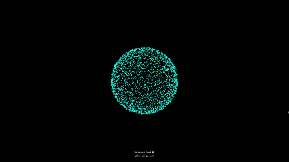

  
  
  
  

# ✨ 3D Particle Magic

**An interactive 3D WebGL particle system driven by AI hand-tracking and custom physics.** یک موتور رندر سه‌بعدی و تعاملی بر پایه هوش مصنوعی و تشخیص حرکات دست.

---

## 🌟 Try the Live Demo
👉 **[Click Here to Experience It Live!](https://ma30ih.github.io/3d-particle-magic/)** 👈
*(Note: Requires camera access to track your hand gestures. All AI processing runs locally on your device.)*

## 🎮 How It Works
After choosing your custom background and magic color from the UI menu, hold your hand in front of the camera:
* **Two Hands Distance:** Dynamically scales the particle sphere (`↔️ Smooth Scaling`).
* **One Finger Pointing (Index Up):** Rotates the 3D particle system based on your finger movement.
* **Fist (All Fingers Down):** Triggers a cosmic Big Bang! The particles explode and bounce off the screen walls.
* **Open Hand (All Fingers Up):** Recovers the scattered matter, bringing particles back to their original 3D sphere shape.

## 🇮🇷 توضیحات فارسی
این پروژه یک شبیه‌ساز فیزیک ذرات سه‌بعدی در محیط WebGL است. کاربر ابتدا در یک منوی تعاملی جذاب، نوع پس‌زمینه و رنگ جادوی خود را انتخاب می‌کند و سپس با حرکات دست، کنترل این جهان سه‌بعدی را به دست می‌گیرد.
* **تغییر سایز دو دستی:** با دور و نزدیک کردن دو دست، کل سیستم ذرات مقیاس‌دهی می‌شود.
* **انفجار و فیزیک برخورد:** با مشت کردن دست، ذرات با سرعت منفجر شده و پس از برخورد به دیواره‌های فرضی صفحه سه‌بعدی، به زیبایی کمانه می‌کنند (Wall Bounce).
* **حریم خصوصی:** تمام پردازش‌های هوش مصنوعی مستقیماً روی مرورگر (لوکال) انجام می‌شود و هیچ ویدیویی ذخیره یا به سروری ارسال نمی‌گردد.

## 🔬 Technical Breakdown / تشریح فنی پروژه

### 🇬🇧 English Description
This project is built to demonstrate core computer graphics, custom physics, and engine architecture principles:
* **Hardware-Accelerated WebGL Rendering:** Utilizing Three.js to render over 3,000 individual particles at a smooth 60FPS using GPU acceleration and `AdditiveBlending` for glow effects.
* **Custom Particle Physics & Collisions:** Implemented a custom physics loop to calculate explosive velocities, momentum dampening, and boundary collision detection (wall bouncing) within the 3D projection space.
* **Multi-Hand Matrix Transformations:** Calculates real-time Euclidean distance between two hands for dynamic spatial scaling, alongside pointer tracking for mapping 2D hand coordinates to 3D matrix rotations.

### 🇮🇷 توضیحات فارسی
این پروژه نمایشی از پیاده‌سازی اصول گرافیک کامپیوتری، محاسبات فیزیک سفارشی و معماری موتورهای رندرینگ تحت وب است:
* **رندرینگ شتاب‌یافته سخت‌افزاری (WebGL):** استفاده از کتابخانه Three.js برای رندر همزمان بیش از ۳۰۰۰ ذره با نرخ ۶۰ فریم بر ثانیه با بهره‌گیری از قدرت پردازنده گرافیکی (GPU).
* **فیزیک ذرات و سیستم برخورد:** پیاده‌سازی حلقه فیزیک اختصاصی برای محاسبه سرعت، تکانه و تشخیص برخورد با دیواره‌های فضای سه‌بعدی صفحه نمایش (Wall Bouncing) در زمان انفجار.
* **ماتریس تبدیلات چنددستی:** محاسبه در لحظه فاصله اقلیدسی بین دو دست برای مقیاس‌دهی فضایی نرم، در کنار نگاشت مختصات دوبعدی دست به چرخش‌های ماتریسی در فضای سه‌بعدی.

## 🛠️ Tech Stack
* HTML5 / CSS3 & Modern UI Architecture
* Vanilla JavaScript (ES6+)
* [Three.js](https://threejs.org/) (WebGL 3D Core Engine)
* [Google MediaPipe Hands](https://google.github.io/mediapipe/solutions/hands)

## 💻 Local Installation
To run this project locally, use a local server (due to browser security restrictions regarding camera access):
* **VS Code:** Install "Live Server" extension and click "Go Live".
* **Python:** Run `python -m http.server` in your terminal.

## 📫 Get In Touch
I'm an independent game developer and tech enthusiast. Whether it's discussing Unreal Engine 5.7 mechanics, collaborating on new business ventures, or just geeking out over hardware and code, I'd love to connect!

* **Email:** msyhan85@gmail.com
